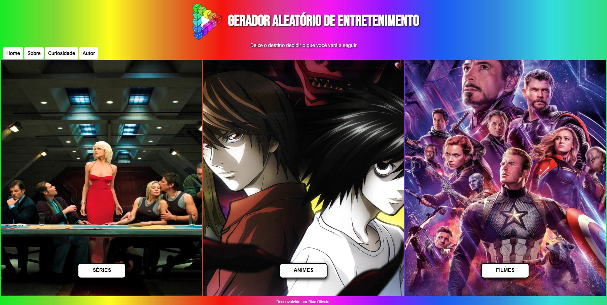

<h1 align="center">Gerador Aleatório de Entretenimento</h1>

## Sobre o Projeto

Programa que sorteia aleatoriamente uma série, anime ou filme para pessoas que querem assistir algo, mas não sabem o quê.

## Layout

## Tecnologias utilizadas

### Front-end (apenas)

*  
*  
* 

## Pré-requisitos

* Navegador (ex: [Google Chrome](https://www.google.com/intl/pt-BR/chrome/))
* Descompactador de arquivos (ex: [WinRAR](https://www.win-rar.com/start.html?&L=0))

## Atualizado em

26 de out. de 2021

## Desenvolvido em

30 de ago. de 2021

<strong>Novas features em Breve!<strong>

Made with 💙 by Rian Dias de Oliveira

